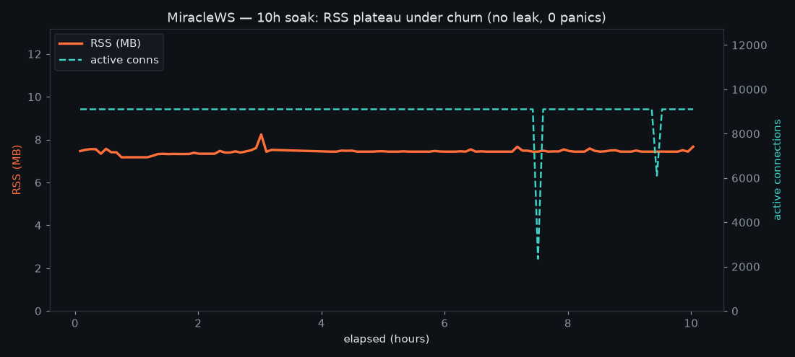

# Soak evidence — 10h continuous, development machine

`overnight.csv` is the raw, unedited metrics log from a 10-hour continuous soak of the
MiracleWS echo server. It is included so the **no-leak** claim can be inspected directly,
not just asserted.

## What was measured

- **Workload:** WebSocket echo, ~9,100 connections held concurrently with **heavy connection
  churn** (open/close cycled continuously — ~14.8M connections accepted and closed over the run).
- **Duration:** 10 hours, sampled every ~300 s (109 samples).
- **Machine:** development box (12-core x86_64), **load generator and server share the same CPU.**

## Result (read straight from the CSV)

| Metric | Value |
|---|---|
| RSS | **7.17 – 8.24 MB, flat** for 10h (hour 1 ≈ hour 10) |
| Active connections | ~9,100 held constant |
| Connections cycled | ~14.8M accepted / ~14.8M closed |
| `panic` | **0** |
| `proto_err` / `utf8_err` / `too_large` | **0 / 0 / 0** |
| `bp_close` (backpressure drops) | 0 |
| `hs_timeout` (handshake timeouts) | 0 |
| p99 latency | ~30–45 ms |

**RSS stays flat across 10 hours and ~14.8M connection cycles → no leak, no unbounded growth,
no panics.** The two brief dips in the active-connection line are load-generator reconnect
storms; RSS is unaffected by them, which is itself part of the no-leak signal.

## Honest scoping

This is the **development-machine** run. p99 here (~30–45 ms) is elevated because the load
generator contends for the same CPU cores as the server — it is **not** the dedicated-rig
figure. The **72h / 100k-connection / p99 894 µs** result quoted in
[`../../EVIDENCE.md`](../../EVIDENCE.md) was measured on a separate dedicated machine; its raw
log lives on that rig and is available on request. This CSV proves leak-freedom under sustained
churn on commodity hardware; the dedicated run proves the latency and scale figures.

## CSV columns

`ts, elapsed_s, rss_kb, fd, cpu_pct, threads, minflt, majflt, vctx, nvctx, tcp_est, tcp_tw,
tcp_cw, sock_orphan, sock_alloc, sock_mem, lat_p50_us, lat_p99_us, active, hs_inflight,
accepted, opened, rejected, closed, hs_timeout, bp_close, proto_err, utf8_err, too_large, panic`
